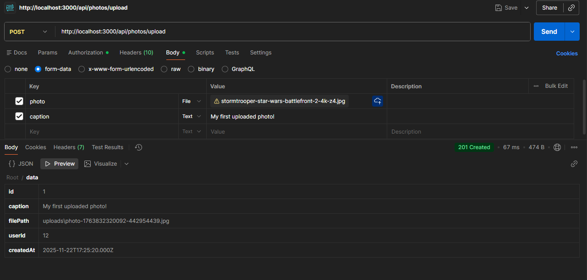
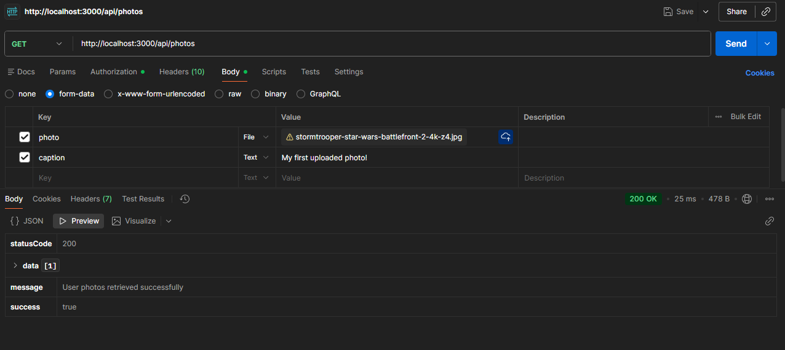
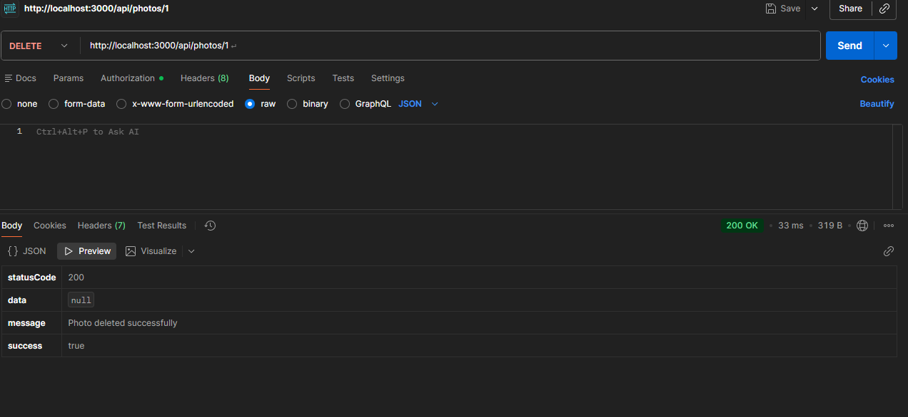

# Finals_Removal – Submission

**Name:** Jared Flores
**Course/Section:** IT4C  

---

## Presentation Checklist

-  Start the server successfully without errors.  

-  Connect to the database and show that the necessary tables exist (`users`, `posts`, `comments`, `photos`).  

-  Use a prepared Postman/Insomnia collection with requests for every endpoint.  

-  Register at least two different users (User A and User B) to demonstrate ownership and authorization.  

-  Use a sample image file to demonstrate the photo upload feature. 

Explain:

- Why I used **bcrypt** for password hashing.  
  - I used bcrypt because it keeps passwords safe. It doesn’t store the real password and it turns it into a hash that can’t be reversed. Even if someone gets into the database, they still won’t know the actual passwords. Bcrypt also adds like a miscellaneous so even if two people use the same password, the hash is different.

- Why I used **JWT** for stateless authentication.  
  - I used JWT so users can stay logged in without the server needing to store sessions. After login, the server gives a signed token and the user includes it in every request. The server just checks the token and no session storage needed.

- Why I used **middleware** (auth, validation, error handler, rate limiting).  
  - Auth, Validation, Error Handler, Rate Limiting middleware keeps everything super clean, reusable and very secure.
---

## 1. Core CRUD Functionality 

  - `POST /api/v1/posts` – create a post

  - `GET /api/v1/posts` – list all posts

  - `GET /api/v1/posts/:id` – get a post by ID

  - `PUT /api/v1/posts/:id` – update a post

  - `DELETE /api/v1/posts/:id` – delete a post  

---

## 2. Authentication System

- `POST /api/v1/auth/register` – registers a new user with **bcrypt-hashed** password.

- `POST /api/v1/auth/login` – logs in a user, verifies credentials, and returns a **signed JWT**.

- Showcase of the `users` table

---

## 3. Authorization & Middleware

- Protected routes (e.g. `/api/v1/posts`) return **401 Unauthorized** if no JWT is provided.  

- User B cannot modify User A’s posts:
  - Attempts return **403 Forbidden** with a clear error message.  

- The Middleware's for:
  - Authentication (`authMiddleware`) - this basically triggers on protected routes
  - Validation (`validator.middleware.js`) - this are used on register/login and posts
  - Centralized error handling (`errorHandler.middleware.js`) - this is to have a clean and consistent JSON
  - Rate limiting (`express-rate-limit`) - this controls how many times a user can send requests

---

## 4. File Uploads (Photos API)

-  `POST /api/v1/photos/upload` – uploads an image using **multipart/form-data**.  

-  The file is saved in the `uploads/` folder.  

-  The correct `filePath`, `userId`, and `caption` are saved to the `photos` table.  

-  `GET /api/v1/photos` – lists photos for the logged-in user.  

- I can open the uploaded image in the browser via `/uploads/<filename>.jpg`.

-  `DELETE /api/v1/photos/:id` – deletes the photo record **and** the physical file from disk.  

---

## 5. Production Readiness & Documentation

- All errors are handled by a **centralized error handler** returning clean JSON responses:
  - 400 (validation), 401, 403, 404.  
    - 400 Bad Request Example
      

    - 401 Unauthorized Example
      

    - 403 Forbidden Example
      

    - 404 Not Found Example
      

- **Security hardening** implemented:
    - I use `helmet` to set safer HTTP headers, `cors` to control which frontend can access the API, and `express-rate-limit` to prevent abuse. There is a global rate limit on `/api`, and a stricter limit on `/api/v1/auth/login` and `/api/v1/auth/register` to protect against brute-force attacks.

    -  I prefixed all routes with `/api/v1` so that future versions of the API like `/api/v2` can be added later without breaking existing clients.

    - Swagger documentation is available at `/api-docs` and includes:
    

---

## 6. Presentation & Code Quality

- As I present the object above, My showcase can clearly walk through the full API flow step by-step starting with authentication, followed by CRUD operations, ownership checks, file upload, deletion, and finally the API documentation. I structured this project using separate controllers and services so the logic is clean, organized, and easy to maintain. Moreover, Middleware handles cross-cutting features like authentication, validation, error handling, and rate limiting, which keeps the code efficient and consistent. In addtion to this, I also chose JWT instead of sessions because it’s stateless, lightweight, and ideal for modern APIs. In conclusion, the codebase is well-organized into folders such as controllers, services, routes, middlewares, and config, with consistent naming and structure, making it simple for another developer to understand and work with.

---

